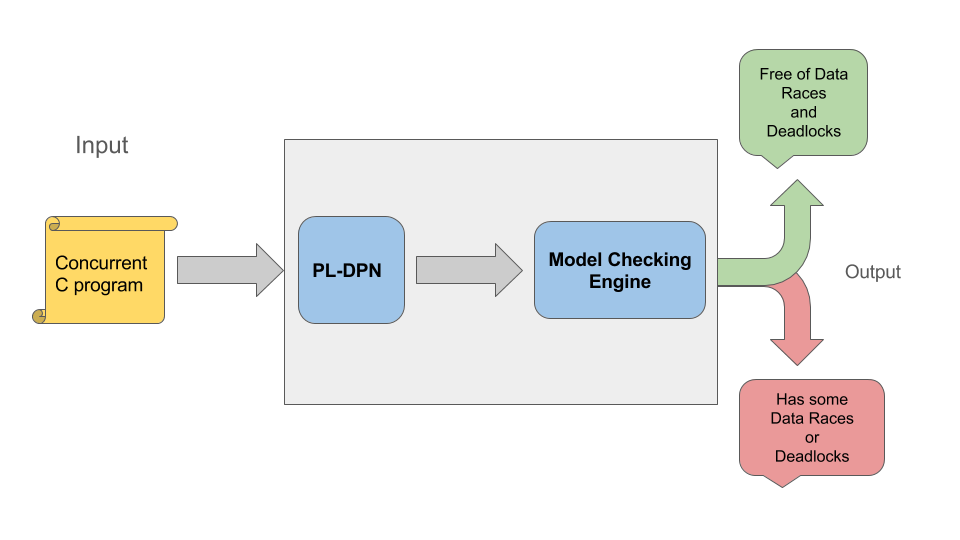

# Chamuyo

Chamuyo is a tool for reachability analysis of concurrent C programs
using locks and priorities for the synchronization of threads.
It can handle automatically the detection of data races and deadlocks.

## Getting Started

This tool is written in **Python 3** and uses the **pycparser** library for parsing
the C code.

### Prerequisites

On Ubuntu, first we need to install **Pip** for Python 3:

> sudo apt-get install python3-pip

Then using *pip3* we install **pycparser**:

> sudo pip3 install pycparser

### Running

For running the tool either over a C file or over a complete directory:

> ./main.py -f tests/small_race.c

Or

> ./main.py -d ./xvisor/core/

### Tests

For running the tests you can do:

> python3 -m unittest tests/tests.py

### Architecture

The tool executes forth steps in order to analize the program:

1. Parsing of C code.
   This step returns an AST (Abstract Syntax Tree) of the program.
   
2. Transformation to PL-DPN.
   This step reads the AST of the program
   and returns a PL-DPN (Priority-Lock Dynamic Pushdown Network).
   See references for more details.
   
3. Saturation of Automaton.
   This step create an automaton for
   each conflictive points in the program and compute the
   predecessors of those points. The predecessors are stored
   inside the corresponding automaton.
   
4. Final check.
   This step check if the initial state of the program
   can be found inside the automaton of the predecessors of each
   conflictive point. In the affirmative case the error is reported
   as a data race or deadlock. Otherwise, the tool did not find
   any error in the program.

### References

- Reachability Analysis of Dynamic Pushdown Networks with Priorities. In Proceedings of NETYS 2017.