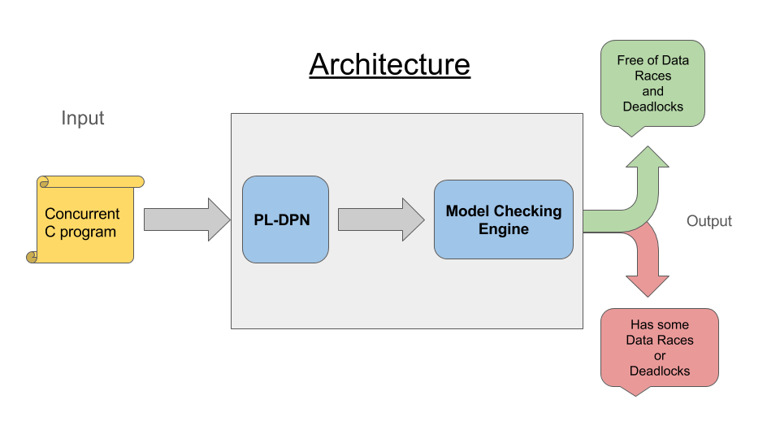

# Chamuyo

Chamuyo is a tool for reachability analysis of concurrent C programs
using locks and priorities for the synchronization of threads.
It can handle automatically the detection of data races and deadlocks.

## Getting Started

This tool is written in **Python 3** and uses the **pycparser** library for parsing
the C code.

### Prerequisites

On Ubuntu, first we need to install **Pip** for Python 3:

> sudo apt-get install python3-pip

Then using *pip3* we install **pycparser**:

> sudo pip3 install pycparser

### Running

For running the tool either over a C file or over a complete directory:

> ./main.py -f file.c

Or

> ./main.py -d /xvisor/core/

### Tests

For running the tests you can do:

> python3 -m unittest tests/tests.py

### Architecture

